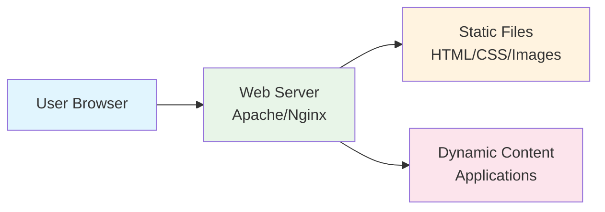

# Day 18: Web Servers (Apache, Nginx, Reverse Proxy)

## Learning Objectives
By the end of Day 18, you will be able to:
- Understand what web servers are and how they work
- Install and configure Apache and Nginx web servers
- Set up basic virtual hosts and server blocks
- Configure a simple reverse proxy with Nginx
- Implement basic SSL/HTTPS with Let's Encrypt
- Troubleshoot common web server issues

## Estimated Time: 1.5-2 hours

## Why Learn Web Servers?

Web servers are essential for hosting websites and applications. Whether you're running a personal blog or a company website, you need a web server to serve your content to users. Understanding web servers helps you:

- Host websites and web applications
- Understand how the internet works
- Configure reverse proxies for applications
- Secure websites with HTTPS
- Troubleshoot web-related issues

---

## What is a Web Server?

A **web server** is software that serves web pages to users' browsers. When you type a website address, a web server receives your request and sends back the web page.

**Simple Analogy:** Think of a web server like a restaurant waiter. When customers (browsers) order food (web pages), the waiter (web server) takes the request to the kitchen (file system), gets the food (web content), and brings it back to the customer.



## How Web Servers Work

**Basic Request Flow:**
1. **User types URL**: example.com in browser
2. **DNS lookup**: Browser finds server's IP address
3. **HTTP request**: Browser sends "GET /index.html" to server
4. **Server processes**: Web server finds the requested file
5. **Response sent**: Server sends HTML, CSS, images back to browser
6. **Page displayed**: Browser renders the web page

## Apache vs Nginx: Key Differences

### Apache HTTP Server
- **How it works**: Creates separate process/thread for each request
- **Good for**: Dynamic content, lots of modules, shared hosting
- **Memory usage**: Higher (each request needs dedicated memory)
- **Configuration**: Very flexible, .htaccess files
- **Example use**: WordPress sites, PHP applications

### Nginx
- **How it works**: Uses event-driven architecture (one process handles many requests)
- **Good for**: Static content, reverse proxy, high traffic
- **Memory usage**: Lower (handles many connections efficiently)
- **Configuration**: Simpler, but less flexible
- **Example use**: Serving images, load balancing, reverse proxy

**Simple comparison:**
- **Apache**: Like having one waiter per table (good service, but expensive with many customers)
- **Nginx**: Like having one efficient waiter handling many tables quickly

## Basic Installation and Setup

### Installing Web Servers

```bash
# Ubuntu/Debian
sudo apt update
sudo apt install apache2 nginx

# CentOS/RHEL
sudo yum install httpd nginx

# Start services
sudo systemctl start apache2 nginx
sudo systemctl enable apache2 nginx

# Check status
sudo systemctl status apache2
sudo systemctl status nginx
```

### Basic Configuration Files

**Apache Configuration:**
```bash
/etc/apache2/
├── apache2.conf          # Main configuration
├── sites-available/      # Website configurations
└── sites-enabled/        # Enabled sites
```

**Nginx Configuration:**
```bash
/etc/nginx/
├── nginx.conf           # Main configuration
├── sites-available/     # Website configurations
└── sites-enabled/       # Enabled sites
```

### Testing Configuration

```bash
# Test Apache configuration
sudo apache2ctl configtest

# Test Nginx configuration
sudo nginx -t

# Reload configurations (no downtime)
sudo systemctl reload apache2
sudo systemctl reload nginx
```

## Virtual Hosts and Server Blocks

**Problem**: You have one server but want to host multiple websites (site1.com, site2.com)

**Solution**: Virtual hosts (Apache) or server blocks (Nginx) tell the web server which website to serve based on the domain name.

### Apache Virtual Host Example

```bash
# Create configuration file
sudo nano /etc/apache2/sites-available/mysite.conf
```

```apache
<VirtualHost *:80>
    ServerName mysite.com
    DocumentRoot /var/www/mysite
    ErrorLog ${APACHE_LOG_DIR}/mysite_error.log
    CustomLog ${APACHE_LOG_DIR}/mysite_access.log combined
</VirtualHost>
```

```bash
# Enable the site
sudo a2ensite mysite.conf
sudo systemctl reload apache2
```

### Nginx Server Block Example

```bash
# Create configuration file
sudo nano /etc/nginx/sites-available/mysite
```

```nginx
server {
    listen 80;
    server_name mysite.com;
    root /var/www/mysite;

    location / {
        try_files $uri $uri/ =404;
    }
}
```

```bash
# Enable the site
sudo ln -s /etc/nginx/sites-available/mysite /etc/nginx/sites-enabled/
sudo nginx -t
sudo systemctl reload nginx
```

## Reverse Proxy Basics

**What is it?** A reverse proxy receives requests from clients and forwards them to backend servers.

**Why use it?**
- Separate web server from application server
- Load balance between multiple backend servers
- Handle SSL encryption
- Cache frequently requested content

### Simple Nginx Reverse Proxy

```nginx
server {
    listen 80;
    server_name myapp.com;

    location / {
        proxy_pass http://localhost:3000;  # Forward to Node.js app
        proxy_set_header Host $host;
        proxy_set_header X-Real-IP $remote_addr;
    }
}
```

This forwards all requests from myapp.com to an application running on port 3000.

**Tip:** You can use the sample Node.js application provided in [`exercise-files/sample-app.js`](exercise-files/sample-app.js) to test reverse proxy functionality. See the exercise-files README for setup instructions.

## SSL/HTTPS Setup with Let's Encrypt

**HTTPS** encrypts data between browser and server. It's essential for security and SEO.

### Installing Certbot

```bash
# Ubuntu/Debian
sudo apt install certbot python3-certbot-nginx python3-certbot-apache

# CentOS/RHEL
sudo yum install certbot python3-certbot-nginx python3-certbot-apache
```

### Getting SSL Certificate

```bash
# For Nginx
sudo certbot --nginx -d yourdomain.com

# For Apache
sudo certbot --apache -d yourdomain.com

# Test automatic renewal
sudo certbot renew --dry-run
```

Certbot automatically:
- Obtains SSL certificate from Let's Encrypt
- Updates your web server configuration
- Sets up automatic renewal

## Practical Exercise: Deploy a Simple Website

Let's create a sample website and configure it with both Apache and Nginx.

**Note:** You can find ready-to-use sample application files in the [`exercise-files/`](exercise-files/) folder. These include a Node.js app for reverse proxy exercises and sample HTML files for testing.

### Step 1: Create Sample Website

```bash
# Create website directory
sudo mkdir -p /var/www/sample-site

# Create simple HTML page
sudo tee /var/www/sample-site/index.html << 'EOF'
<!DOCTYPE html>
<html>
<head>
    <title>My Sample Site</title>
    <style>
        body { font-family: Arial, sans-serif; margin: 40px; }
        .container { max-width: 600px; margin: 0 auto; }
    </style>
</head>
<body>
    <div class="container">
        <h1>Welcome to My Sample Site</h1>
        <p>This is a simple website served by a web server.</p>
        <p>Server timestamp: <span id="time"></span></p>
    </div>

    <script>
        document.getElementById('time').textContent = new Date().toLocaleString();
    </script>
</body>
</html>
EOF

# Set proper permissions
sudo chown -R www-data:www-data /var/www/sample-site
sudo chmod -R 755 /var/www/sample-site
```

### Step 2: Configure Apache

```bash
# Create Apache virtual host
sudo tee /etc/apache2/sites-available/sample-site.conf << 'EOF'
<VirtualHost *:8080>
    ServerName localhost
    DocumentRoot /var/www/sample-site

    <Directory /var/www/sample-site>
        AllowOverride All
        Require all granted
    </Directory>

    ErrorLog ${APACHE_LOG_DIR}/sample-site_error.log
    CustomLog ${APACHE_LOG_DIR}/sample-site_access.log combined
</VirtualHost>
EOF

# Configure Apache to listen on port 8080
echo "Listen 8080" | sudo tee -a /etc/apache2/ports.conf

# Enable site
sudo a2ensite sample-site.conf
sudo systemctl reload apache2

# Test
curl http://localhost:8080/
```

### Step 3: Configure Nginx

```bash
# Create Nginx server block
sudo tee /etc/nginx/sites-available/sample-site << 'EOF'
server {
    listen 80;
    server_name localhost sample-site.local;
    root /var/www/sample-site;

    location / {
        try_files $uri $uri/ =404;
    }

    # Optional: Basic security headers
    add_header X-Frame-Options DENY;
    add_header X-Content-Type-Options nosniff;
}
EOF

# Enable site
sudo ln -s /etc/nginx/sites-available/sample-site /etc/nginx/sites-enabled/
sudo nginx -t
sudo systemctl reload nginx

# Test
curl http://localhost/
```

## Common Commands Reference

```bash
# Service Management
sudo systemctl start apache2/nginx
sudo systemctl stop apache2/nginx
sudo systemctl restart apache2/nginx
sudo systemctl reload apache2/nginx
sudo systemctl status apache2/nginx

# Configuration Testing
sudo apache2ctl configtest
sudo nginx -t

# Log Monitoring
sudo tail -f /var/log/apache2/error.log
sudo tail -f /var/log/nginx/error.log

# Site Management (Apache)
sudo a2ensite sitename
sudo a2dissite sitename

# Site Management (Nginx)
sudo ln -s /etc/nginx/sites-available/site /etc/nginx/sites-enabled/
sudo rm /etc/nginx/sites-enabled/site
```

## Basic Troubleshooting

### Common Issues and Solutions

**1. Web server won't start**
```bash
# Check if port is already in use
sudo netstat -tlnp | grep :80

# Check configuration
sudo apache2ctl configtest
sudo nginx -t

# Check logs
sudo journalctl -u apache2
sudo journalctl -u nginx
```

**2. Website shows default page**
```bash
# Check if your site is enabled
ls -la /etc/apache2/sites-enabled/
ls -la /etc/nginx/sites-enabled/

# Check document root permissions
ls -la /var/www/
```

**3. Permission denied errors**
```bash
# Fix ownership
sudo chown -R www-data:www-data /var/www/yoursite

# Fix permissions
sudo chmod -R 755 /var/www/yoursite
sudo chmod -R 644 /var/www/yoursite/*.html
```

## Key Interview Questions

**Q1: What is the difference between Apache and Nginx?**
**A:** Apache uses a process/thread-based model where each request gets its own process or thread. Nginx uses an event-driven architecture where one worker process can handle thousands of connections simultaneously. Nginx is generally faster for static content and uses less memory, while Apache has more modules and is more flexible for dynamic content.

**Q2: How do you configure a reverse proxy in Nginx?**
**A:** Use the `proxy_pass` directive in a location block:
```nginx
location / {
    proxy_pass http://localhost:3000;
    proxy_set_header Host $host;
    proxy_set_header X-Real-IP $remote_addr;
}
```

**Q3: How do you enable HTTPS on a website?**
**A:** Install Certbot and run `sudo certbot --nginx -d yourdomain.com` or `sudo certbot --apache -d yourdomain.com`. This automatically obtains an SSL certificate from Let's Encrypt and configures your web server.

**Q4: What are virtual hosts?**
**A:** Virtual hosts allow one web server to host multiple websites. They work by checking the domain name in the request and serving content from different directories based on the domain.

**Q5: How do you check if a web server is working?**
**A:**
- Check service status: `sudo systemctl status nginx`
- Test configuration: `sudo nginx -t`
- Check if port is listening: `sudo netstat -tlnp | grep :80`
- Test with curl: `curl http://localhost/`
- Check error logs: `sudo tail /var/log/nginx/error.log`

## Completion Checklist

- [ ] Can install Apache and Nginx web servers
- [ ] Understand the difference between Apache and Nginx
- [ ] Can create and configure virtual hosts/server blocks
- [ ] Can set up a basic reverse proxy
- [ ] Can obtain and configure SSL certificates
- [ ] Can troubleshoot common web server issues
- [ ] Can check logs and monitor web server status

## Next Steps

Ready to learn about advanced storage management? Proceed to [Day 19: Advanced Linux Storage & Filesystems](../Day_19/notes_and_exercises.md)